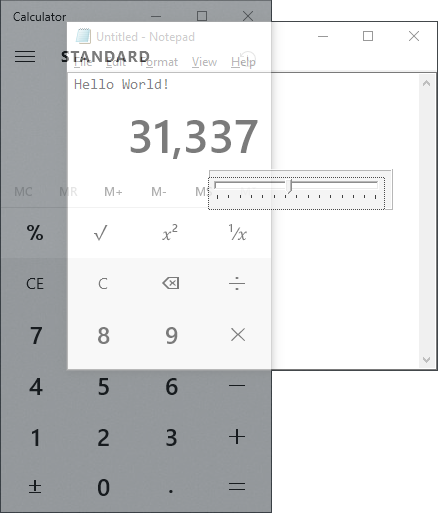

# Translucer

### About:
A hotkey utility that allows you to adjust the transparency of any application in Windows.

### Instructions:
Run the application, switch to the application you want to make transparent, press CTRL+ALT+T to pop up the transparency slider and move it to make the application window more or less transparent - press ESC to dismiss the slider.

### Screenshot:

### Info:
**Created:** 2005

**Operating System:** Windows 2000 or newer

**Compile with:** Borland C++ Builder 6
